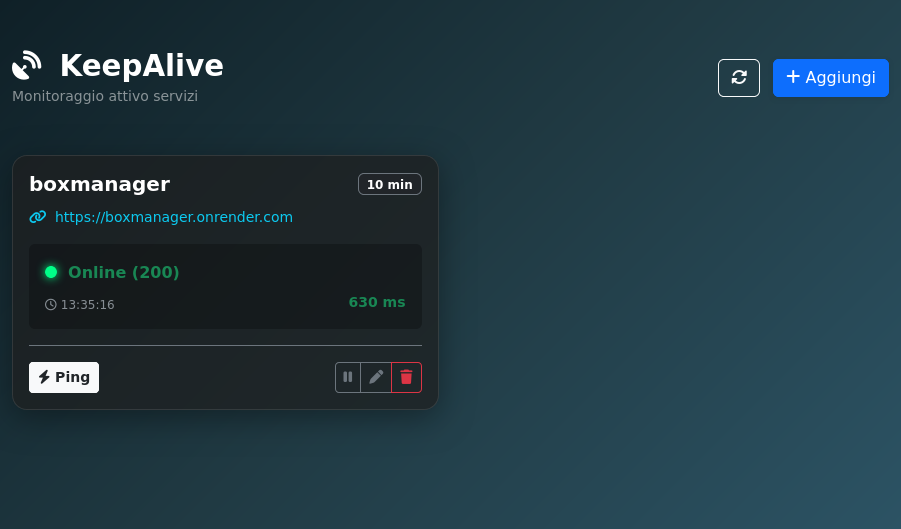

# KeepAlive - Uptime Monitoring & Host Health Dashboard



Applicazione web moderna per monitorare la disponibilità e la salute di host/servizi remoti. Realizzata con **Flask**, **SQLite**, e **APScheduler** per eseguire check periodici automatici in background. Ideale per mantenere sotto controllo infrastrutture, siti web e servizi critici con uptime tracking e storico delle risposte.

**Tech Stack:** Python 3.9+ | Flask | SQLAlchemy | APScheduler | HTML/CSS | SQLite | Docker

---

## Build + Run con restart automatico

**Build dell'immagine:**
```bash
docker build -t nome-app .
```

**Run con restart policy:**
```bash
docker run -d \
  --name nome-app \
  --restart unless-stopped \
  -p 5000:5000 \
  -v $(pwd)/instance:/app/instance \
  nome-app
```

### Avvio automatico al boot del sistema

Dipende dal sistema:

**systemd (Linux moderno):**
```bash
sudo systemctl enable docker   # Docker stesso si avvia al boot
```
Con `--restart unless-stopped` il container riparte automaticamente quando Docker si avvia.

**Verifica:**
```bash
docker inspect nome-app | grep RestartPolicy
```

---

## Uso con Docker Compose (consigliato)

Prima crea la cartella persistente del database:

```bash
mkdir -p instance
```

Avvio in background:

```bash
docker compose up -d --build
```

Log in tempo reale:

```bash
docker compose logs -f
```

Stop dei servizi:

```bash
docker compose down
```

L'app sarà disponibile su:

```text
http://localhost:5000
```